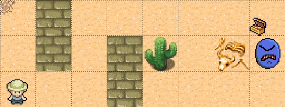

# Navigation through a dynamic map using the Bellmann equation
 

 
This repo contains the source code used to generate the results in the
Medium article
[Navigation through a dynamic map using the Bellmann equation](https://medium.com/)
 
A detailed description of the applied method can be found the provided
[pdf document](rl.pdf).

The results can be replicated by using the provided 
[jupyter notebook](RL_01_reforged.ipynb).